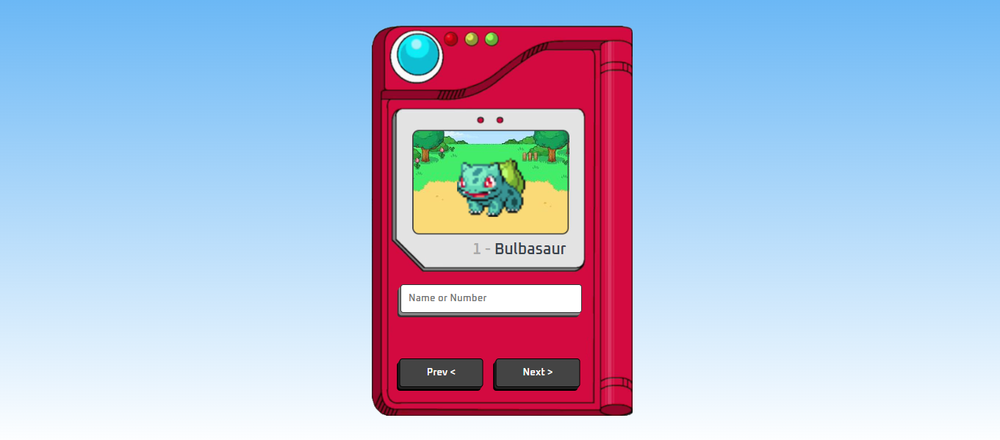

# JOGO DO POKEDEX
☑️JOGO EM HTML/CSS/JS.

   

## DESCRIÇÃO:
Esta é uma aplicação simples que permite ao usuário pesquisar e visualizar informações sobre Pokémon usando a PokeAPI.

- `pokemonName`, `pokemonNumber`, `pokemonImage`: Referências aos elementos HTML onde o nome, número e imagem do Pokémon serão exibidos.
- `form`, `input`, `buttonPrev`, `buttonNext`: Referências aos elementos HTML relacionados ao formulário de pesquisa e aos botões de navegação.
- `searchPokemon`: Variável que mantém o número do Pokémon atualmente exibido.
- `fetchPokemon`: Função assíncrona que faz uma solicitação para a PokeAPI para obter dados do Pokémon especificado pelo número.
- `renderPokemon`: Função assíncrona que renderiza as informações do Pokémon na página HTML com base nos dados obtidos da PokeAPI. Também atualiza a variável `searchPokemon` com o número do Pokémon exibido.
- `submit` no formulário: Quando o formulário é enviado, a função `renderPokemon` é chamada com o valor inserido no campo de pesquisa.
- `click` nos botões de navegação (`buttonPrev` e `buttonNext`): Quando um desses botões é clicado, a função `renderPokemon` é chamada para exibir o Pokémon anterior ou seguinte, respectivamente.
- A função `renderPokemon` é chamada inicialmente para exibir o Pokémon com o número especificado pela variável `searchPokemon`.
- O código usa a PokeAPI para obter os dados do Pokémon, incluindo nome, número e imagem.
- Ao pesquisar por um Pokémon, o código converte o valor inserido para minúsculas antes de enviar a solicitação à API.
- Os botões "Anterior" e "Próximo" permitem ao usuário navegar pelos Pokémon sequencialmente, incrementando ou decrementando o número do Pokémon atual.
- Se um Pokémon não for encontrado, uma mensagem "Not found :c" será exibida.

## NÃO SABE?
- Entendemos que para manipular arquivos em `HTML`, `CSS` e outras linguagens relacionadas, é necessário possuir conhecimento nessas áreas. Para auxiliar nesse aprendizado, oferecemos cursos gratuitos disponíveis:
* [CURSO DE CANVAS](https://github.com/VILHALVA/CURSO-DE-CANVAS)
* [CURSO DE HTML E CSS](https://github.com/VILHALVA/CURSO-DE-HTML-E-CSS)
* [CURSO DE JAVASCRIPT](https://github.com/VILHALVA/CURSO-DE-JAVASCRIPT)
* [CONFIRA MAIS CURSOS](https://github.com/VILHALVA?tab=repositories&q=+topic:CURSO)

## CREDITOS:
- [PROJETO CRIADO PELO "manualdodev"](https://github.com/manualdodev/pokedex)
- [PROJETO EDITADO PELO VILHALVA](https://github.com/VILHALVA)
